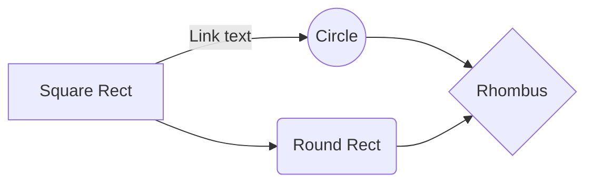

# Project1_GreeterApp
This is Hello world in Solidity wherein I had completed "Blockchain at Berkley" course. This has end-to-end coding from setting up the node to writing smart contracts, web3.js and deployment using truffle.

